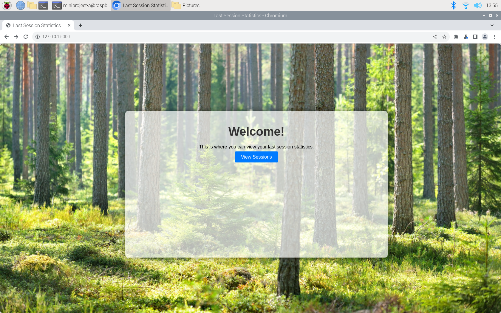
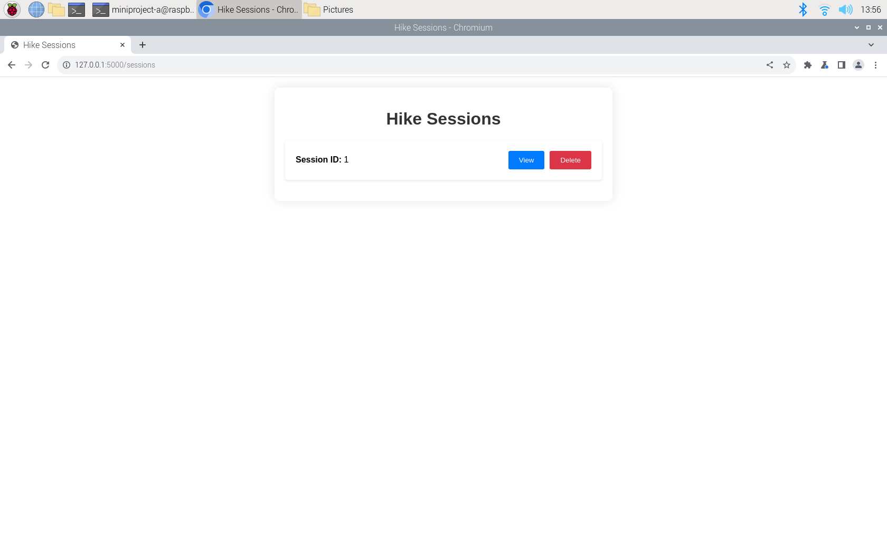
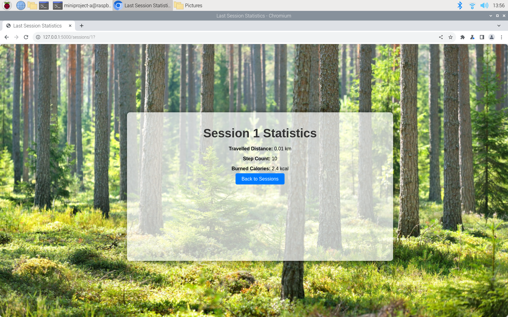

# MiniProject

## Name
Hiking Tour Assistant with LilyGo T-Watch 2020 V3.

## Description
This project is firmware for the LilyGo T-Watch 2020 to be used as a Hiking Assistant. With this firmware the watch can be used during hikes to measure steps and travelled distance. In this project repository is also software for a Raspberry Pi computer and code for a WebUI. The steps and distance can be saved to the watch and sent to the Raspberry Pi via Bluetooth communication. The Raspberry Pi will estimate burned calories during the hike from the steps and distance data that is uploaded from the watch. There is also a webserver implemented in the software for the Raspberry Pi and a WebUI that goes together with the webserver. In the WebUI the user can check hiking data from all the sessions that has been sent from the watch to the Raspberry Pi and it is also possible to delete sessions.

## Visuals
###### T Watch Start Screen
{width=20% height=20%}
###### T-Watch Hiking Session ongoing
{width=20% height=20%}
###### WebUI Welcome page
{width=50% height=50%}
###### WebUI Hiking Sessions page
{width=50% height=50%}
###### WebUI Session data page
{width=50% height=50%}
###### Demo video

## Installation
The installation of the T-Watch firmware:
- Clone this repository 
- Install Visual Studio Code ([Follow link to download VSCode](https://code.visualstudio.com/Download))
- Install PlatformIO extension in VSCode ([Follow link to install in VSCode](https://marketplace.visualstudio.com/items?itemName=platformio.platformio-ide))
- Open Watch_ttGo_fw folder in VSCode and open Watch_ttGo_fw\src\main.cpp
- Press the ✓ symbol in the VSCode status bar to compile the code
- Connect the T-Watch, choose the correct COM port in the status bar and upload the code to the watch by pressing the → symbol in the status bar

Using the Rasberry Pi software:
- Clone this repository
- Install the following libraries to python using pip:
    - pybluez
    - flask
    - pillow

## Usage
LilyGo T-Watch Hiking Assistant
- A hiking session can be started by pressing the START button on the T-Watch
- The T-Watch screen can be turned off by pressing the side button to save battery charge
- After the session is started the T-Watch will start counting steps and calculating travelled distance
- Press STOP button when the hike is completed
- The T-Watch saves the session data and goes back to the start screen
- Press SEND button on the start screen to send the saved data from the T-Watch to the Rapsberry Pi via Bluetooth (requires that the T-Watch and RPi are connected to each other)

Rasberry Pi Bluetooth receiver and WebUI
- Open two terminals on the RPi
- cd to ./RP_APP/RPi
- Start receiver.py by running the command **python3 receiver.py**
- Do same thing for wserver.py in the other terminal
- Send data from the T-Watch to RPi
- Open a web browser and browse to "http://127.0.0.1:5000" to open the WebUI
- View or delete hiking session data in the WebUI

## Support
If you have questions or problems feel free to send an email to mikael.dahlbom@aalto.fi
